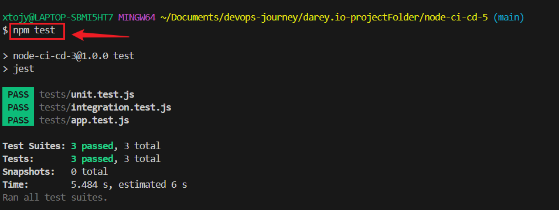
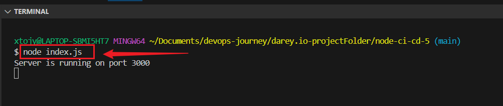
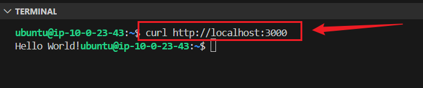

# GitHub Actions CI/CD for AWS EC2 Deployment

# 🚀 Node.js CI/CD Pipeline with GitHub Actions & AWS EC2

## Introduction

This project implements a **CI/CD pipeline** using **GitHub Actions** to automate the building, testing, and deployment of a **Node.js application** to an **AWS EC2 instance**.

## 📌 Features

✅ Automated build and test workflow  
✅ Deployment to AWS EC2 using SSH  
✅ Caching for faster builds  
✅ Secure handling of secrets  
✅ Parallelized job execution  

---

## 📁 Project Structure

. ├── .github/workflows │ ├── build.yml # Build & test workflow │ ├── deploy.yml # Deployment workflow ├── src/ │ ├── index.js # Main server file │ ├── app.js # Application logic │ ├── routes/ # API routes │ ├── models/ # Database models ├── package.json ├── README.md └── ...


---

## 🛠️ **Setup Instructions**

### 1️⃣ **Clone the Repository**

```
git clone https://github.com/Joy-it-code/node-ci-cd-5.git
cd node-ci-cd-5
```

Install Dependencies

```
npm install
```

### 3️⃣ Run the Application Locally


```
npm start
```

or using **PM2:**

```
pm2 start index.js --name "node-app"
```

---

## 🚀 CI/CD Workflow

1️⃣ Build & Test Workflow (.github/workflows/build.yml)

✅ Runs on push to main

✅ Lints and tests the code

✅ Uses a matrix strategy for multiple Node.js versions

✅ Caches dependencies for faster builds

 **.github/workflows/build.yml**
```
name: Build and Test Node.js Application

on:
  push:
    branches:
      - main

jobs:
  build-and-test:
    runs-on: ubuntu-latest
    strategy:
      matrix:
        node-version: [18.x, 20.x, 22.x]
    steps:
      - name: Checkout Repository
        uses: actions/checkout@v4

      - name: Setup Node.js
        uses: actions/setup-node@v4
        with:
          node-version: ${{ matrix.node-version }}
          cache: 'npm'

      - name: Install Dependencies
        run: npm ci

      - name: Run ESLint
        run: npx eslint . --ext .js

      - name: Run Tests
        run: npm test
```

---

## 2️⃣ Deploy Workflow 
(.github/workflows/deploy.yml)

✅ Triggers **only after** successful build

✅ Connects to **AWS EC2** using SSH

✅ Pulls the latest code and restarts the application


```
name: Deploy Node.js App to AWS EC2

on:
  workflow_run:
    workflows: ["Build and Test Node.js Application"]
    types:
      - completed

jobs:
  deploy:
    runs-on: ubuntu-latest
    steps:
      - name: Checkout code
        uses: actions/checkout@v4

      - name: Configure AWS Credentials
        uses: aws-actions/configure-aws-credentials@v4
        with:
          aws-access-key-id: ${{ secrets.AWS_ACCESS_KEY_ID }}
          aws-secret-access-key: ${{ secrets.AWS_SECRET_ACCESS_KEY }}
          aws-region: us-east-1

      - name: Set up SSH Key
        run: |
          mkdir -p ~/.ssh
          echo "${{ secrets.EC2_SSH_KEY }}" | tr -d '\r' > ~/.ssh/ci-cd-key
          chmod 600 ~/.ssh/ci-cd-key
          ssh-keyscan -H ${{ secrets.EC2_HOST }} >> ~/.ssh/known_hosts

      - name: Deploy to AWS EC2
        uses: appleboy/ssh-action@master
        with:
          host: ${{ secrets.EC2_HOST }}
          username: ubuntu
          key: ${{ secrets.EC2_SSH_KEY }}
          script: |
            cd ~/node-ci-cd-5 || git clone https://github.com/Joy-it-code/node-ci-cd-5.git ~/node-ci-cd-5
            cd ~/node-ci-cd-5
            git pull origin main
            npm install
            pm2 restart index.js || pm2 start index.js --name "node-app"
```

---
**Run test On Terminal:**
```
npm test
node index.js
curl http://18.208.177.81:3000
```



**Run test On Browser:**
```
http://localhost:3000
http://18.208.177.81:3000
```

**On EC2 Instance to Monitor log**
```
curl http://localhost:3000
pm2 logs index.js
pm2 list
```


---

## 🔒 Security Best Practices

**🔹 Use GitHub Secrets** to store sensitive information like:

+ AWS_ACCESS_KEY_ID
+ AWS_SECRET_ACCESS_KEY
+ EC2_SSH_KEY
+ EC2_HOST

### 🔹 Set permissions in your workflow to least privilege


```
permissions:
  contents: read  # Only allow read access
  id-token: write # Needed for AWS authentication
```

**🔹 Avoid hardcoding secrets**

Use:

```
env:
  ACCESS_TOKEN: ${{ secrets.ACCESS_TOKEN }}
```

Instead of:

```
env:
  ACCESS_TOKEN: "my-hardcoded-token"
```

---


⚡ Performance Optimization

✅ **Parallelized Jobs** – Run tests on multiple Node.js versions

✅ **Caching Dependencies** – Cache **node_modules** to speed up builds

✅ **Optimized Deployment** – Only deploy if build & tests succeed

## Implement Caching for Faster Builds

✅ Use caching to store dependencies so they don’t have to be reinstalled every time.

**🔹 Modify build.yml to cache dependencies:**

```
- name: Cache Node Modules
  uses: actions/cache@v4
  with:
    path: ~/.npm
    key: ${{ runner.os }}-node-${{ hashFiles('**/package-lock.json') }}
    restore-keys: |
      ${{ runner.os }}-node-
```

---

## 🔹Improve Security
### Implement the Principle of Least Privilege

✅ Modify deploy.yml permissions to only allow what is needed.


```
permissions:
  contents: read  # Only allow read access to the repository
  id-token: write # Needed for AWS authentication
```

## 📊 Monitoring & Debugging

**📌 Check Logs** in GitHub Actions tab

**📌 Monitor EC2 Instance**


```
ssh -i ~/.ssh/ci-cd-key.pem ubuntu@your-ec2-ip
pm2 logs
```

**📌 Troubleshoot Errors**
If deployment fails: 

```
journalctl -u node-app --no-pager --lines=50
```

---

💡 Conclusion
This GitHub Actions CI/CD pipeline automates building, testing, and deploying a Node.js application to AWS EC2 securely and efficiently. By following best practices, the workflow is optimized for performance, security, and maintainability.

---

**Author: Joy Nwatuzor**

**Happy Coding 🎉 and Automating**